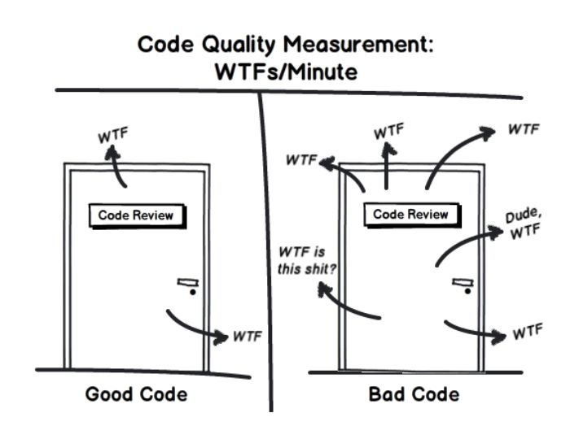
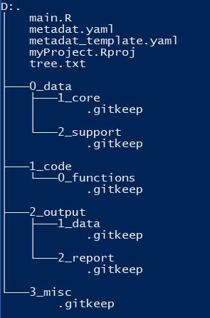
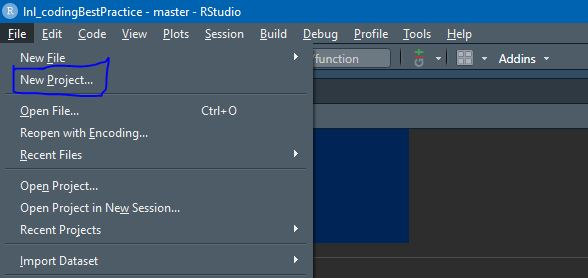

```{r knitr_init, echo = FALSE, results = "asis", cache = FALSE}
library(knitr)
library(rmdformats)

## Global options
options(max.print = "75")
opts_chunk$set(echo    = TRUE,
               cache   = FALSE,
               prompt  = FALSE,
               tidy    = FALSE,
               comment = NA,
               message = FALSE,
               warning = FALSE)
opts_knit$set(width = 75)
```

# Introduction

There are a lot of coding styles out there and like the [previous lunch and learn](https://github.com/EuropAssistanceInsurance/lnl_dataViz), we can't say what is right and what is wrong. However, we can definitely say what is bad!

Coding can in some nerdy way be seen as a form of art. The choice of variable names, the spacing, the consistency, the efficiency of the code... All these things make a coder feel proud of what they have created.

One thing that rings true in any organization is consistency. If these creative geniuses all express their art in their own way, we will never be able to properly review anyone's work.

```{r fig.show = "hold", out.width = "50%", fig.align = "default", echo = FALSE}

```

Good clean code in an organization is absolutely essential!

Some of the key points we will discuss today :

1. Version Control
2. Project Structure
3. Variable Naming Conventions
4. Coding Style
5. When to Markdown
6. To Function or Not To Function
7. Package That
8. MetaData
9. Controlling Your Environment

```{r fig.show = "hold", out.width = "50%", fig.align = "default", echo = FALSE}
knitr::include_graphics("dsLogo.png")
```

# Version Control

We have been talking about version control each time in the lunch and learns and I cannot stress enough how good it is to start getting familiar with version control. The sooner you master the skill the better it will be eventually.

Version control, using git, is a very convenient way of keep tract of all changes in a project over time as well as making work in joint projects much smoother. How many times have you seen `myFile_v0.xlsx`, `myFile_v1.xlsx`, `myFile_v2.xlsx`, `myFile_v2_final.xlsx` - what does these files mean??? This slows down collaboration as well.

Git and GitHub solves this problem. Git is the underlying logic and GitHub is an online web-provider for git. We can also find BitBucket or GitLab, but the underlying technology of all of these is git.

For more information on git and GitHub, please see [the introduction video](https://eaholding.sharepoint.com/sites/DataScience/Documents%20partages/Lunch%20And%20Learn/Recordings/2020_07_17%20-%20Introduction%20and%20GitHub/Meeting%20in%20_Lunch%20And%20Learn_%20.mp4). You can also just Google it and find loads of resources online to help you learn more about it.

# Project Structure {.tabset .tabset-fade}

Setting up a consistent project structure will help with other colleagues reviewing your code. A logical structure I tend to follow is as follow :

```{r fig.show = "hold", out.width = "50%", fig.align = "default", echo = FALSE}

```

When we have a clean and consistent naming convention for projects it makes working together a lot easier.

In the tabs below we will go through the general logic of each folder

## Root Folder

In this folder we only keep the main files that "drive" the project. This includes the `.Rproj` file which is automarically generated by R when you create a new project. When coding in R, you should ALWAYS code using R Projects

```{r fig.show = "hold", out.width = "50%", fig.align = "default", echo = FALSE}

```

What this does, is it allows you to work in a single project environment. By doing this, all files, folders and code is wrapped up in a single folder. If  we moved the folder the project will still work. 

This is true for other coding languages as well (such as creating a project in PyCharm).

We then also have a metadata template and the metadata file as well. The template is something that can be shared (pushed to GitHub for instance), where the metadata (not template) contains user sensitive information, such as passwords or authenication keys. You should NEVER put these things in code. If a file like this is shared, there is no control over who did what.

Then we also have our `main.R` file. This file gives instruction to the rest of the code, i.e. loading packages, loading data, cleaning data and creating the report.

We can put all the code in one single file, but it will end up being quite a lot for someone new to understand what is going on.

Finally, we should also have our `.gitignore` file here which will control which files should be sent to github and which should stay locally. Remember, data files or the metadata file should not go to GitHub.

## 0_data

The data folder is broken up into 2 parts, it contains the main data source that we are analyzing as well as some supporting data. The supporting data can be something like a look-up table or another file that needs to be merged onto the "main" data.

These folders can in turn be split up in different folders if needed - like in the `core data` folder, we can have seperate folders for `sales` and `claims` data. It isn't a hard and fast rule, but this is a guideline for how to structure your data.

We could also have connections to databases, where we might not need this folder at all. The connection details should be stored in the metadata file.

Finally, if your data lies on a server then I would recommend one of 2 approaches :

### Copy Paste

Copy the data from the server to the local folder location. 

|                 Advantages                |                      Disadvantages                       |
|-------------------------------------------|:--------------------------------------------------------:|
| All files are in a single location        | If a file on the server is updated, it won't be captured |
| Faster - no connection to Server required | Duplicating data                                         |
| Stable - no connection to Server required |                                                          |
    
This should only be done if the amount of data is not extremely large. For instance if the size of the files exceed 5Gb, then this will not be a good solution.

If files on a server location is extremely large, then the question to be asked is **"Shouldn't this be in a DataBase???**

### Pointing to the Server Location

You can also load the files from their location on the server. 


As you can see I use single words and underscores `_` instead of spaces. This is simply since in code it makes things easier to work with. For instance, if we wanted to load a file :

C:\\projects\\My project\\my data.csv

Then we will need to load the file in some way such as :

myData <- read.csv("C:\\projects\\\`My project\`\\\`my data.csv\`")

# Variable Naming Conventions


# Coding Style


# When to Markdown


# To Function or Not To Function


# Package That


# MetaData


