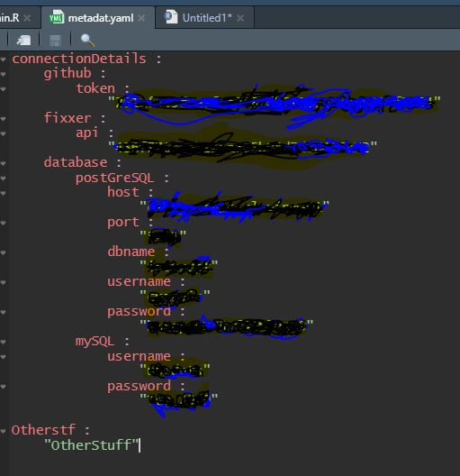

```{r knitr_init, echo = FALSE, results = "asis", cache = FALSE}
library(knitr)
library(rmdformats)

## Global options
options(max.print = "75")
opts_chunk$set(echo    = TRUE,
               cache   = FALSE,
               prompt  = FALSE,
               tidy    = FALSE,
               comment = NA,
               message = FALSE,
               warning = FALSE)
opts_knit$set(width = 75)
```

# Introduction

```{r}
library(dplyr)
library(ggplot2)
```

There are a lot of coding styles out there and like the [previous lunch and learn](https://github.com/EuropAssistanceInsurance/lnl_dataViz), we can't say what is right and what is wrong. However, we can definitely say what is bad!

Coding can in some nerdy way be seen as a form of art. The choice of variable names, the spacing, the consistency, the efficiency of the code... All these things make a coder feel proud of what they have created.

One thing that rings true in any organization is consistency. If these creative geniuses all express their art in their own way, we will never be able to properly review anyone's work.

```{r fig.show = "hold", out.width = "50%", fig.align = "center", echo = FALSE}
knitr::include_graphics("cleanCode.jpg")
```

Good clean code in an organization is absolutely essential!

---

Some of the key points we will discuss today :

1. Version Control
2. Project Structure
3. Variable Naming Conventions
4. Commenting
5. Coding Style
6. When to Markdown
7. To Function or Not To Function
8. Package That
9. MetaData
10. Controlling Your Environment

```{r fig.show = "hold", out.width = "50%", fig.align = "center", echo = FALSE}
knitr::include_graphics("dsLogo.png")
```

# Version Control

We have been talking about version control each time in the lunch and learns and I cannot stress enough how good it is to start getting familiar with version control. The sooner you master the skill the better it will be eventually.

Version control, using git, is a very convenient way of keep tract of all changes in a project over time as well as making work in joint projects much smoother. How many times have you seen `myFile_v0.xlsx`, `myFile_v1.xlsx`, `myFile_v2.xlsx`, `myFile_v2_final.xlsx` - what does these files mean??? This slows down collaboration as well.

Git and GitHub solves this problem. Git is the underlying logic and GitHub is an online web-provider for git. We can also find BitBucket or GitLab, but the underlying technology of all of these is git.

For more information on git and GitHub, please see [the introduction video](https://eaholding.sharepoint.com/sites/DataScience/Documents%20partages/Lunch%20And%20Learn/Recordings/2020_07_17%20-%20Introduction%20and%20GitHub/Meeting%20in%20_Lunch%20And%20Learn_%20.mp4). You can also just Google it and find loads of resources online to help you learn more about it.

# Project Structure {.tabset .tabset-fade}

Setting up a consistent project structure will help with other colleagues reviewing your code. A logical structure I tend to follow is as follow :

```{r fig.show = "hold", out.width = "50%", fig.align = "default", echo = FALSE}

```

When we have a clean and consistent naming convention for projects it makes working together a lot easier.

In the tabs below we will go through the general logic of each folder

## Root Folder

In this folder we only keep the main files that "drive" the project. This includes the `.Rproj` file which is automarically generated by R when you create a new project. When coding in R, you should ALWAYS code using R Projects

```{r fig.show = "hold", out.width = "50%", fig.align = "default", echo = FALSE}

```

What this does, is it allows you to work in a single project environment. By doing this, all files, folders and code is wrapped up in a single folder. If  we moved the folder the project will still work. 

This is true for other coding languages as well (such as creating a project in PyCharm).

We then also have a metadata template and the metadata file as well. The template is something that can be shared (pushed to GitHub for instance), where the metadata (not template) contains user sensitive information, such as passwords or authenication keys. You should NEVER put these things in code. If a file like this is shared, there is no control over who did what.

Then we also have our `main.R` file. This file gives instruction to the rest of the code, i.e. loading packages, loading data, cleaning data and creating the report.

We can put all the code in one single file, but it will end up being quite a lot for someone new to understand what is going on.

Finally, we should also have our `.gitignore` file here which will control which files should be sent to github and which should stay locally. Remember, data files or the metadata file should not go to GitHub.

## 0_data

The data folder is broken up into 2 parts, it contains the main data source that we are analyzing as well as some supporting data. The supporting data can be something like a look-up table or another file that needs to be merged onto the "main" data.

These folders can in turn be split up in different folders if needed - like in the `core data` folder, we can have seperate folders for `sales` and `claims` data. It isn't a hard and fast rule, but this is a guideline for how to structure your data.

We could also have connections to databases, where we might not need this folder at all. The connection details should be stored in the metadata file.

Finally, if your data lies on a server then I would recommend one of 2 approaches :

### Copy Paste

Copy the data from the server to the local folder location. 

|                 Advantages                |                      Disadvantages                       |
|-------------------------------------------|:--------------------------------------------------------:|
| All files are in a single location        | If a file on the server is updated, it won't be captured |
| Faster - no connection to Server required | Duplicating data                                         |
| Stable - no connection to Server required |                                                          |
    
This should only be done if the amount of data is not extremely large. For instance if the size of the files exceed 5Gb, then this will not be a good solution.

If files on a server location is extremely large, then the question to be asked is **"Shouldn't this be in a DataBase???**

### Pointing to the Server Location

You can also load the files from their location on the server. This can be done by storing the server location in the metadata and loading it to to project. This will keep the project clean and consistent. 

If files are loaded from different locations, each folder can seperately be stored in the metadata file.

| Advantages | Disadvantages |
|---------------------------------------|:---------------------------------------:|
| If the file is updated then you will directly have the most recent version | Slower to run - need to connect to server |
| The entire team will be able to have direct access to your data, and running the project will work the same for everyone | Not stable - if the connection to the server is lost the data won't load |
| | If someone changed the file loaded in a "wrong" way then the code might not work |

## 1_code

The code folder is broken up into 2 parts as well, it contains a folder containing functions written for the particular project as well as the root part. In the root folder of the code section, we split the code into logical segments. These could be **1_dataPrep.R**, **2_featEng.R**... These files will each be called from the **main.R** file in the project root folder.

This is done to keep thing tidy, have 3 files clearly explained and structured is much more readable than having 1 file with everything in it.

## 2_output

We also split the output into multiple sections, the first part is the data that is generated by the project (if it is a desire to output this). This could also contain multiple data outputs from the project.

The second part fo this folder is a place where we store the report that the project generates.

It is also possible to have other outputs. In this case just create a folder for them.

## 3_misc

This section contains other files that you might want to add. A typical example would an image file to be added to the report (like EA logo).

## Further tips

### Naming

As you can see I use single words and underscores `_` instead of spaces. This is simply since in code it makes things easier to work with. For instance, if we wanted to load a file :

C:\\projects\\My project\\my data.csv

Then we will need to load the file in some way such as :

myData <- read.csv("C:\\projects\\\`My project\`\\\`my data.csv\`")

We also keep the folder names in a lower case and in "English" naming, i.e. we don't use any accents for the folders of file names. All of this is to help making the code work without problems.

The final thing you can see is the numer in-front, we use this as a logical sequence in which we code.

### .gitkeep

You will see some folders have this file called `.gitkeep` this is simply an empty file that we create and put in a folder so that when we push the folder to GitHub, we have the folder structure available in the repository (pushing empty folders just won't push the folder).

### Getting the Folder Structure

You can get the folder structure from GitHub [here](https://github.com/EuropAssistanceInsurance/lnl_codingBestPractice/tree/master/projectStructure)

# Variable Naming Conventions

There are a large number of naming conventions, here are some :

1. alllowercase: e.g. adjustcolor
2. period.separated: e.g. plot.new
3. underscore_separated: e.g. numeric_version
4. lowerCamelCase: e.g. addTaskCallback
5. UpperCamelCase: e.g. SignatureMethod

I like 4 (sometimes combined with 3). Lower Camel Case makes it easy to seperate words, combining this with variable groups makes your life a lot easier. For example, if we have data about the person insured, the vehicle insured and the contract itself, we could have something like this :

per_name; per_address; per_numCell; per_numHome
veh_make; veh_model; veh_horsePower; veh_weight
con_type; con_startDt; con_endDt

It isn't easy to find clear and meaningful variable names all the time, but it is worth spending some time to clearly define these.

To keep code clean, please use the same naming conventions within your team, company and the biggest dream - the entire group! It is also best to keep the names in English - not because I am English speaking, but for auditing purposes it makes things easier.

# Commenting

No one likes writing comments, but it is of absolute importance to do this. Giving an introduction to a file is always a good idea! Taking some time to write 2 or 3 sentences to describe what the file is supposed to do is a great help for someone who will use the code again.

While you are coding, comment before sections as well, it helps to know when one section ends and another one starts.

It doesn't make sense to comment each line and a lot of time even complex code can be understood by just reading it. However, when you are doing something really advance take some time to really explain line-by-line.

Commenting does not only help other people, but it will remind you on what you have done and why you did that.

# Coding Style {.tabset .tabset-fade}

The coding style is something quite personal, but I would recommend the following 

## Spacing

Like any good book, you read it in paragraphs and sentences are broken up with spaces, commas, points, etc. This structure is the same in code.

### Line Spacing

Within lines of code, it is good practice to space out your code so that the code kind of "breaths", for instance, which piece of code reads easier :

`someVariable<-log(x)^9+100/(otherVar+10)-540`

`someVariable <- (log(x))^9 + 100/(otherVar + 10) - 540`

There is no reason to cramp everything up in one line. Imagine that we have 100's or 1000's of lines of code as above and we don't have spacing. It would be like reading a book with no spaces or paragraphs.

### Paragraph Spacing

As with lines, we need to space out chunks of code with "enters" so that we create paragraphs. Take the following code for example yet again :

Example 1
```{r}
subsetMt<-mtcars%>%dplyr::select(cyl,wt,vs,am,disp)%>%filter(disp>100)
mtfin<-subsetMt%>%mutate(wt_vs=wt*vs)
mtfin%>%ggplot(aes(x=am,y=wt_vs))+geom_jitter()
```

Example 2
```{r}
subsetMt <- mtcars %>%
  dplyr::select(cyl, wt, vs, am, disp) %>%
  filter(disp > 100)

mtfin <- subsetMt %>%
  mutate(wt_vs = wt*vs)

mtfin %>%
  ggplot(aes(x = am, y = wt_vs)) +
  geom_jitter()
```

I'll let you judge which reads easier

## Assing with Arrows ( <- )

Assigning something to a variable can either be done by using an equal sign (`=`) or an arrow (`<-`). In programming assigning a variable with an equal sign is ambiguous, since this is also an operator, testing equality. This is overcome by making equality with a double equal sign (`==`).

Take the following as an example :

Example 1
```{r}
a = 3 == 3
a
```

Example 2
```{r}
a <- 3 == 3
a
```
The first example is undoubtedly more difficult to read.

For more information please refer to [this link](https://colinfay.me/r-assignment/).

## Tidyverse

In R, there is a way of coding using the tidyverse, which is developed by Hadley Wickham (one of the world's most renowned Data Scientists). The tidyverse offers a clean and consistent way of coding.

The tidyverse also introduces a very useful function called "the pipe". Essentially, the pipe (`%>%`) take output from the left hand side and passes it through to the right hand side. This allows you to string operations making it read much nicer, for example :

```{r}
mtcars %>% 
  filter(gear %in% c(3, 5)) %>% 
  select(mpg, cyl, disp) %>% 
  mutate(mpg_disp = mpg * disp,
         cyl      = cyl %>% as.character()) %>% 
  group_by(cyl) %>% 
  summarise(n           = n(),
            aveMPG      = mpg      %>% mean(na.rm = TRUE),
            totmpg_disp = mpg_disp %>% sum(na.rm  = TRUE))
```

You can also see that I aligned spaces such that similar operation are underneath each other. This is just something I like to do, since it makes it more readable.

### When not to use the Tidyverse

There are 3 very distinct ways of coding in R.

1) base R
2) tidyverse
3) data.table

Each of these have their own advantages. 

**base R**
When writing functions, you would always like to reduce dependencies, so when writing functions try to stick to base R.

**tidyverst**
For general purpose coding this is your go-to way of working

**data.table**
data.table is significantly faster than the previous 2 **when working with big data**. If your code takes tens of minutes or hours to run, try to find out where it is slow and write that section of code using **data.table**.

Why not simply use **data.table**, you could, but this way of working is much more complex than the tidyverse. 

If speed becomes a big issue, then we can also use dbplyr (from the tidyverse) which allows you to code in the tidyverse style but process the code on the server. We can also use Julia or Python (other languages) and call them from within R. Julia is known to be the fastest, so being able to call Julia from within R is a great feature.

## Structure

As mentioned before, we want to structure the project to flow "naturally", however we want our files of code to flow in the same way. 

Do NOT load packages in different places in your code. The best practice is to create a "setup" script where you load and setup your environment. When you need to install another package, do it in this script.

In scripts, keep sections together. If you are loading different data sources, it is best to load one file perform actions on that dataset and then continue to the next data source and code related to that source. When merging these datasets or binding them do this in a logical next step.

There is no hard rule on how to structure your code, but try and make it as readable as possible.

## Managing Your Environment

If you are loading data, try to avoid creating copies of that dataset as much as possible in memory. This means avoid `data2 <- data %>% ...`, the reason is that `data2` will take up memory space and by overwriting `data` where possible, we are saving memory. 

Cleaning up your environment is also quite useful, as it makes things less cluttered. If you are no longer using a certain object in memory, remove it (`rm()`)

# When to Markdown

Markdown is what you are seeing now. This is extremely useful for reproducible research and reports.

Markdown can be used for any sort of ad-hoc or recurring report. 

Then, when should it not be used? I would not recommend creating data products/pipelines in Markdown, but in separate scripts. If you want to productionise a project, then regular scripts should be used. This pipeline can as a result produce a Markdown document as well.


# To Function or Not To Function

There is a very common and widely accepted logic that if you were to write the same piece of code more than twice, then you should rather create a function for it.

Functions are pieces of code that takes input and generate some sort of output. It will allow the user to write much cleaner and more concise code.

# Package That

When you are moving between projects, using the same functions you might want to improve functions and by moving from projects A to B to C, the function evolves over time. By putting functions in a separate package, we keep the function updated across all projects. 

So why don't we always packages functions? Well... If we have a very specific function for a particular project, that won't cross different projects, then there is no reason to put that function in a package.

# MetaData {.tabset .tabset-fade}

Metadata is data that is loaded to control the code within. There are a few forms of Metadata :

1. Controlling Access
2. Data Manipulation

## Controlling Access 

As mentioned before, you should **NEVER** put your username, password or database details in your code! There are multiple ways of dealing with this, but one way is using metadata. We can use a `yaml` file to control these parameters for our code

```{r fig.show = "hold", out.width = "50%", fig.align = "center", echo = FALSE}

```

This file can be read simply as `metaDat <- yaml::read_yaml(file = "metadat.yaml")` then we can use the parameters from the `metaDat` object.

## Data Manipulation

We can create a separate file such as the one below :

```{r fig.show = "hold", out.width = "50%", fig.align = "center", echo = FALSE}

```

We can then use this file as both a data dictionary as well as an instruction sheet (readable by anyone) to understand what basic data processing is done to the data that is loaded.

You can write up a function that will apply the logic written above in single line of code. If you would use the same logic as the file above. We have a function that does this in the group and will be adding that to our eaR repository in the coming weeks.

### When to do this?

For most small ad-hoc projects, creating files like the one shown above will be time-consuming and add more ambiguity than helping the project read better. I would advise to only create these file when you are working on big projects.

With that said, I would advise to **ALWAYS** create this sort of file when working on big projects.

# Controlling Your Environment

When we have projects that will be run by different people, we often run into a problem of making the code work on someone else's computer. This is mainly due to the dependencies that your project has on external libraries that does not come with the base installation. This is true for both R, Python, Julia and even Java.

This means that if you are working on a project and you are working with a package, let's say `dplyr v1.2` then after let's say a month you are still working with the same package, but now online there are `dplyr v1.3`. If you give your code to someone they will get `v1.3` while the code works with `v1.2`. If we do not update our code to work with the new version, there might be some bugs.

To ensure that people can work efficiently with your code, a best practice is to create the environment that they will need to run your code and give that as a "bundled" solution.

We have 3 options to do this :

1. conda
2. Docker
3. renv (only for R)

## Conda

There is no better way to explain what conda does than by copy-pasting their opening line :

*Package, dependency and environment management for any language---Python, R, Ruby, Lua, Scala, Java, JavaScript, C/ C++, FORTRAN*

Simply put, conda gives us a way to re-create the same environment as what the developer used.

All the information about how to create, export and load environments in conda can be found [here](https://docs.conda.io/projects/conda/en/latest/user-guide/tasks/manage-environments.html#building-identical-conda-environments)

## Docker

Docker is a bit more abstract, what Docker does is much more than conda. Docker creates a virtual environment on your local machine. What this means is that is literally creates an operating system (Linux) followed but the exact software and package you want to have installed on that machine. This VM will be "living" on your machine locally (or on a server). What Docker gives us is that we can take that entire environment, clone it and share it across teams. If someone clones a Docker container (image) then the cloned container will always work 100% without even requiring the other user to set-up an environment.

Docker also allows us to host projects remotely and can access those projects via APIs. Imagine having a pricing model build in R or Python and hosted in a Docker container. We can then send our variables to the containter via an API and get the premium directly sent back to us.

For more information about Docker, please refer to [this link](https://docker-curriculum.com/)

## renv

renv is a package management solution built specifically for R. I haven't used it yet, but it seems to be the easiest solution for R.

For more information on renv, please follow [this link](https://rstudio.github.io/renv/articles/renv.html)

## When is this important

Managing environments is extremely useful, however it is not useful for each project. However, it is good to get into the habit of creating environments even if it is not that important.

If there is no reason to believe that the code you are writing will be shared with other people, then there is no need to do this. As soon as you start sharing code, then this becomes very important.


